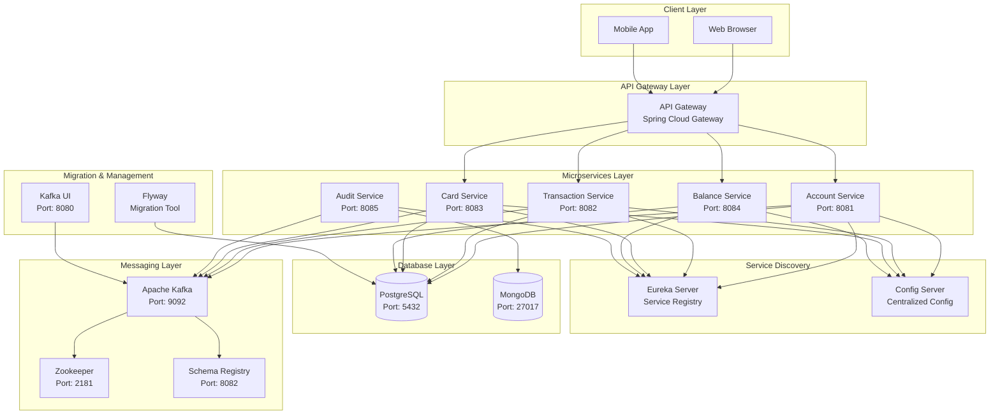
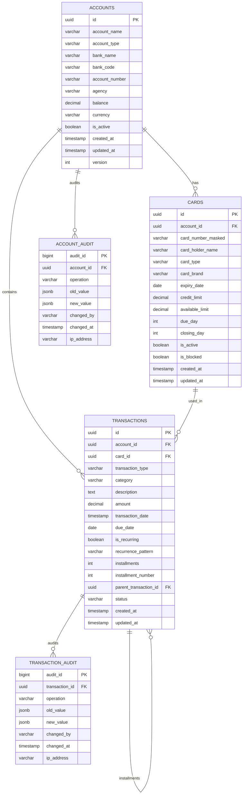
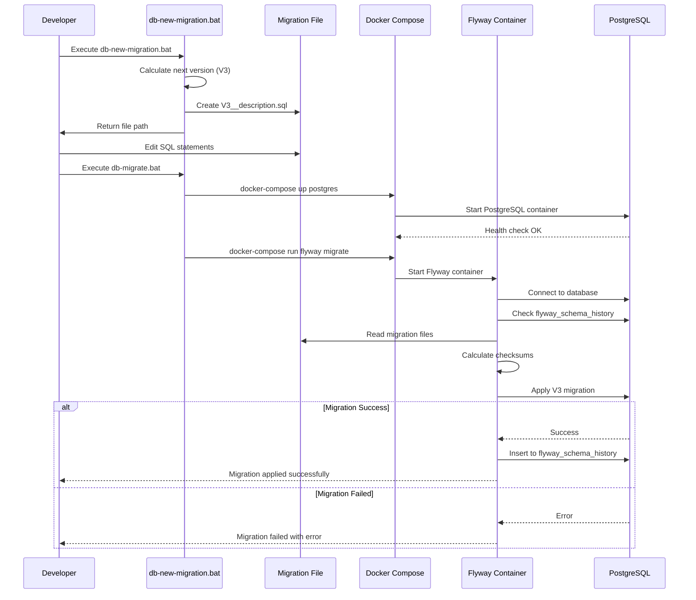
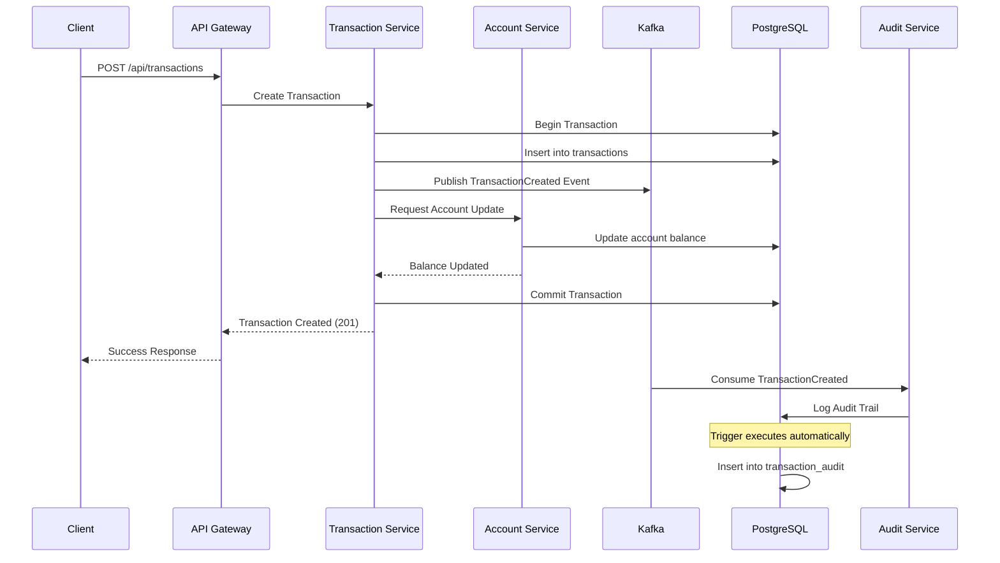
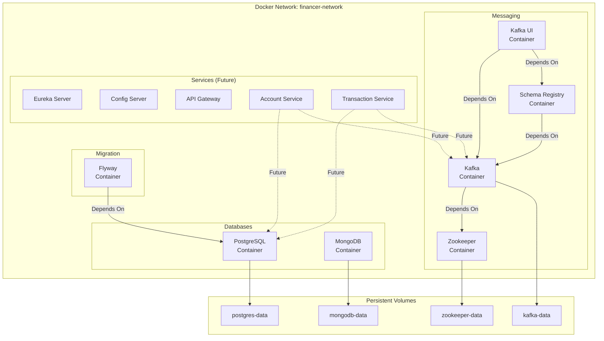
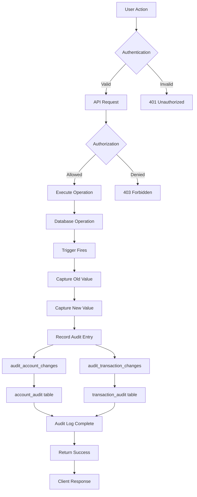
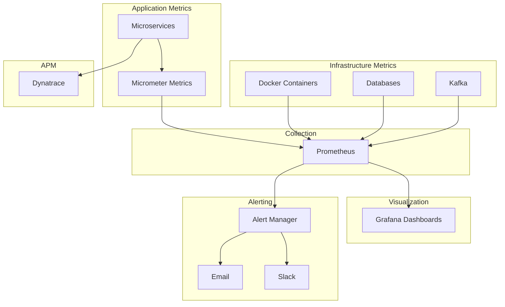
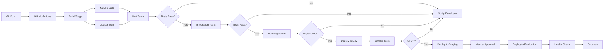

# 🏗️ Arquitetura - Financer System

Documentação visual da arquitetura do sistema Financer.

---

## 📊 Diagrama de Arquitetura Geral

---

## 🗄️ Diagrama de Banco de Dados

---

## 🔄 Fluxo de Migration

---

## 🎯 Fluxo de Transação

---

## 🐳 Docker Compose Stack

---

## 📈 Estado Atual do Sistema

```mermaid
graph LR
    subgraph "Implementado ✅"
        A[Database Schema]
        B[Migration System]
        C[Docker Infrastructure]
        D[Auditoria Automática]
        E[Scripts de Gestão]
    end
    
    subgraph "Em Progresso 🚧"
        F[Account Service]
        G[Config Server]
        H[Eureka Server]
    end
    
    subgraph "Planejado 📋"
        I[Transaction Service]
        J[API Gateway]
        K[Frontend Angular]
        L[CI/CD Pipeline]
    end
    
    A --> B
    B --> C
    C --> D
    D --> E
    
    E -.-> F
    F -.-> G
    G -.-> H
    
    H -.-> I
    I -.-> J
    J -.-> K
    K -.-> L
    
    style A fill:#90EE90
    style B fill:#90EE90
    style C fill:#90EE90
    style D fill:#90EE90
    style E fill:#90EE90
    
    style F fill:#FFD700
    style G fill:#FFD700
    style H fill:#FFD700
    
    style I fill:#87CEEB
    style J fill:#87CEEB
    style K fill:#87CEEB
    style L fill:#87CEEB
```

---

## 🔐 Segurança e Auditoria

---

## 📊 Monitoramento (Futuro)

---

## 🚀 CI/CD Pipeline (Planejado)

---

**Versão:** 1.0.0  
**Última Atualização:** 2025-11-07
